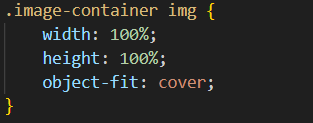
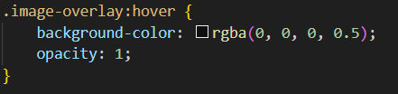

# Travelopia

CSS Styles for Full Page Component

Global Styles

These styles ensure that there is no default margin or padding on the body and HTML elements, and the component takes up the full height of the viewport.

Container Styles

This sets up a flex container with a column layout, and it ensures the container takes at least the full height of the viewport.

Header Styles

Styles for the header, including a fixed height, centered content, and a grey background color.

Image Container Styles

Styles for the image container, making it flexible, relative to its parent, and hiding any overflow.

Image Styles

Ensures the image takes up the full width and height of its container while maintaining its aspect ratio.

Image Overlay Styles

Styles for the image overlay, positioned absolute to cover the image, initially transparent, and transitioning on hover.

Hover Styles

Styles applied when hovering over the image, creating a semi-transparent overlay.

Text and Button Styles

Styles for the overlay title, ensuring white text color.

Footer Styles

Styles for the footer, with a fixed height and a grey background color.

Responsive Styles

Media queries to make adjustments to font sizes for header and overlay title on medium and smaller screens.
